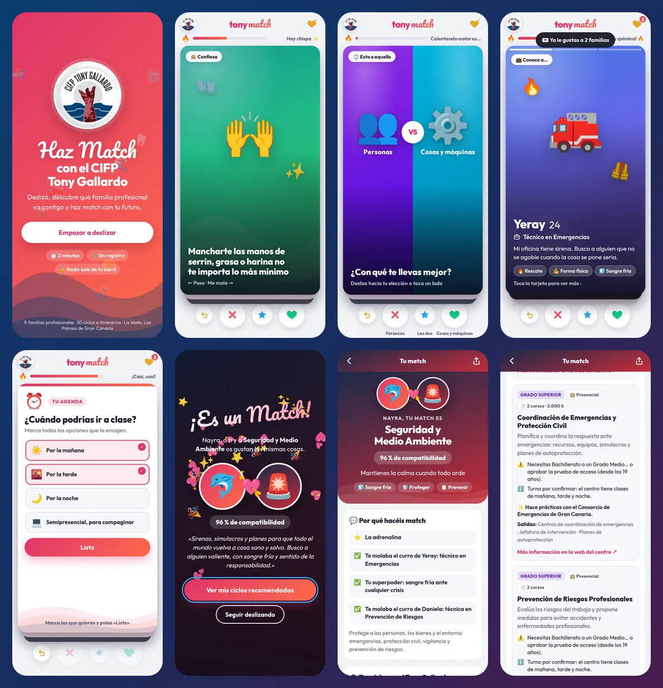

# 💘 Haz Match con el CIFP Tony Gallardo

Web app al estilo Tinder para descubrir con qué **familia profesional** del
[CIFP Tony Gallardo](https://www3.gobiernodecanarias.org/medusa/edublog/cifptonygallardo/)
(La Isleta, Las Palmas de Gran Canaria) haces match.

Deslizas tarjetas sobre tus gustos, contestas preguntas rápidas sobre tus estudios, tu edad
y tu horario y, cuando se cumplen las condiciones… **¡es un match!** Después te recomienda
los ciclos concretos del centro que encajan contigo, tu itinerario y cómo contactar.



## Cómo se juega

| Gesto | Botón | Teclado | Significado |
| --- | --- | --- | --- |
| Deslizar a la derecha | ♥ | → | Me mola |
| Deslizar a la izquierda | ✕ | ← | Paso |
| Deslizar hacia arriba | ★ | ↑ | ¡Me encanta! (cuenta doble) |
| — | ↺ | Retroceso | Deshacer |

Para que no sea obvio, el mazo mezcla cinco tipos de tarjeta:

- **Gustos, manías y situaciones** («Por el ruido de un motor sabes si algo va bien»,
  «Un peque llora en la guagua y te salen solos los trucos para calmarle»…). La mayoría no
  dicen a qué familia apuntan.
- **Esto o aquello**: dos opciones enfrentadas (madera o metal, prevenir o actuar,
  mojo rojo o mojo verde…). Se desliza hacia la elegida o se toca un lado.
- **Perfiles de ejemplo** al estilo Tinder (Nayra, técnica en Mecatrónica; Iván, educador
  infantil…). Se toca la tarjeta para ver «Un día conmigo» y «Para llegar aquí».
- **Preguntas rápidas**: estudios, edad, horario (mañana, tarde, noche o semipresencial),
  meta, estilo de aprendizaje, superpoder y sábado ideal.
- **Datos del centro** (Erasmus+, el barco de madera de FP Básica, el Consorcio de
  Emergencias…).

Mientras juegas, un termómetro de **química** avanza, aparecen avisos del tipo
«💌 ¡Le gustas a una familia profesional!» y el corazón dorado muestra las familias
interesadas en ti, desenfocadas hasta el match.

## ¿Cuándo hay match?

El motor (`js/motor.js`) suma puntos a las familias con cada respuesta y va eligiendo las
tarjetas: primero explora todas las familias y luego busca tarjetas que confirmen a la
favorita, la separen de la segunda y ayuden a ordenar sus ciclos. Hay match cuando se cumplen
**todas** estas condiciones:

1. Has deslizado al menos **12 tarjetas**.
2. Has contestado las preguntas imprescindibles: **estudios, edad y horario**.
3. Todas las familias han aparecido alguna vez.
4. Has dado **al menos 3 likes** a tarjetas de la familia líder.
5. La líder tiene una afinidad alta y **saca ventaja clara** a la segunda.

Si a las 26 tarjetas ninguna destaca, el match se hace con la líder («no ha sido un flechazo
a primera vista…»). Después se puede seguir deslizando y hacer match con otra familia.

Con usuarios simulados que tienen una familia favorita, la app la acierta en el 100 % de los casos, con el
match hacia la tarjeta 19 (12 deslizamientos más preguntas rápidas y datos).

## Qué te recomienda

- **Tus ciclos en el Tony Gallardo**, ordenados según tus estudios, tu edad, la modalidad y el
  turno, con avisos claros (✅ puedes acceder / ⚠️ necesitas Bachillerato o prueba de acceso…).
- **Tu camino en el centro**: Básico → Medio → Superior dentro de la misma familia, marcando
  por dónde empiezas.
- **Por qué hacéis match**: las tarjetas que más han sumado.
- **También tienes química con…** y el ranking de las 9 familias.
- **Tu disponibilidad**, **cómo apuntarte** (plazos de referencia) y **contacto** con botones
  para llamar, escribir, ver el mapa, la web y las redes del centro.
- **Compartir** el resultado.

## Oferta incluida (según la web del centro)

| Familia | Ciclos |
| --- | --- |
| Actividades Físicas y Deportivas | GS Enseñanza y Animación Sociodeportiva · GS Acondicionamiento Físico |
| Comercio y Marketing | IFC+21 Actividades Auxiliares de Almacén (FP Adaptada) |
| Hostelería y Turismo | IFC+21 Operaciones Básicas de Restaurante y Bar (FP Adaptada) |
| Industrias Alimentarias | GB Actividades de Panadería y Pastelería |
| Instalación y Mantenimiento | GB Fabricación y Montaje · GM Mantenimiento Electromecánico · GS Mecatrónica Industrial |
| Madera, Mueble y Corcho | GB Carpintería y Mueble · GM Carpintería y Mueble · GS Diseño y Amueblamiento |
| Sanidad | GM Cuidados Auxiliares de Enfermería · GS Higiene Bucodental |
| Seguridad y Medio Ambiente | GM Seguridad · GM Emergencias y Protección Civil · GS Coordinación de Emergencias y Protección Civil · GS Prevención de Riesgos Profesionales |
| Servicios Socioculturales y a la Comunidad | GM Atención a Personas en Situación de Dependencia · GS Educación Infantil (presencial y semipresencial) · GS Integración Social (presencial y semipresencial) |

GB = Grado Básico · GM = Grado Medio · GS = Grado Superior.

## Ponerla en marcha

No necesita instalar nada ni compilar: es HTML, CSS y JavaScript.

```bash
npm start            # sirve la carpeta en http://localhost:8080
# o bien
python3 -m http.server 8080
```

**Publicarla**

- **En tu servidor, en la carpeta `Tony_Match`**, con un solo comando desde un ordenador con
  `ssh` (Linux, Mac, o Windows con Git Bash o WSL):

  ```bash
  ./desplegar.sh usuario@tu-servidor /var/www/html ~/.ssh/tu-clave
  ```

  Sube solo los archivos de la web a `/var/www/html/Tony_Match` (cambia la ruta si tu
  servidor publica otra carpeta). Si el servidor tiene `git`, también vale entrar en él y
  clonar el repositorio en esa carpeta. Y sin terminal: sube por SFTP (FileZilla, WinSCP…)
  `index.html`, `manifest.webmanifest` y las carpetas `css`, `js` y `assets` a una carpeta
  `Tony_Match`.
- **GitHub Pages**: *Settings → Pages → Deploy from a branch*, rama principal y carpeta raíz.
- **Cualquier hosting estático**: basta con subir la carpeta tal cual.
- **Dentro del blog del centro**, con un iframe:

  ```html
  <iframe src="https://TU-DIRECCION/" title="Haz Match con el CIFP Tony Gallardo"
          width="420" height="820" style="border:0;border-radius:24px;max-width:100%"></iframe>
  ```

**Modo quiosco** para jornadas de puertas abiertas en una tablet o pantalla táctil: añade
`?kiosco` a la dirección. La app vuelve sola al inicio tras dos minutos sin uso y oculta el
botón de compartir.

También se puede **instalar en el móvil** («Añadir a pantalla de inicio»).

## Editar los contenidos

| Archivo | Qué contiene |
| --- | --- |
| `js/datos.js` | Contacto, familias, ciclos (modalidades y turnos), curiosidades y plazos de admisión |
| `js/tarjetas.js` | El mazo: textos y pesos de cada tarjeta (`f` por familia, `c` por ciclo) |
| `js/motor.js` | `AJUSTES`: mínimo y máximo de tarjetas, umbrales del match y posición de las preguntas |

Después de tocar el mazo, ejecuta `npm test`: comprueba que los datos son coherentes, que
**todas las familias pueden ganar** y que el acceso a cada ciclo según estudios y edad es
correcto.

### Pendiente de confirmar con el centro

- **Turno de cada ciclo** (mañana, tarde o noche): el campo `turnos` está vacío y la app
  invita a consultarlo en secretaría. En cuanto se rellene, las recomendaciones lo tendrán en
  cuenta con la disponibilidad de cada persona.
- Duración de Cuidados Auxiliares de Enfermería y requisitos concretos de los IFC+21.
- Plazos de admisión de cada curso (ahora figuran los de 2026 como referencia).

## Privacidad y accesibilidad

- Sin registro, sin cookies, sin analítica y sin peticiones a terceros (las tipografías van
  incluidas). Las respuestas no salen del dispositivo.
- Todo se puede hacer con botones o teclado, con etiquetas y avisos para lectores de pantalla.
  Respeta «reducir movimiento» y el modo oscuro del sistema.

## Estructura

```
index.html              Pantallas y iconos SVG
css/estilos.css         Estilos (claro/oscuro, móvil y escritorio)
js/datos.js             Datos del centro
js/tarjetas.js          Mazo de tarjetas
js/motor.js             Puntuación, selección adaptativa y condiciones de match
js/app.js               Interfaz: gestos, match y resultados
tests/motor.test.js     Pruebas del motor y los datos (node --test)
assets/                 Logo, iconos de la app y tipografías
```

## Créditos

- Datos: web oficial del CIFP Tony Gallardo y su oferta educativa.
- Tipografías [Outfit](https://fonts.google.com/specimen/Outfit) y
  [Pacifico](https://fonts.google.com/specimen/Pacifico) (SIL Open Font License), incluidas en
  `assets/fonts`.
- Los perfiles de las tarjetas son personajes de ejemplo. El resultado es orientativo: para
  decidir, habla con el departamento de orientación del centro.
